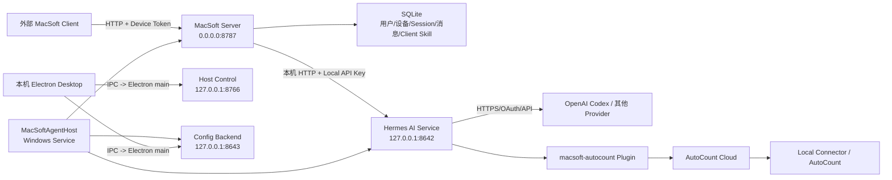
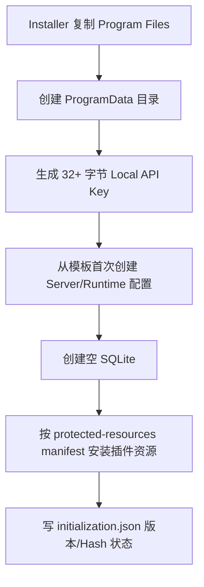
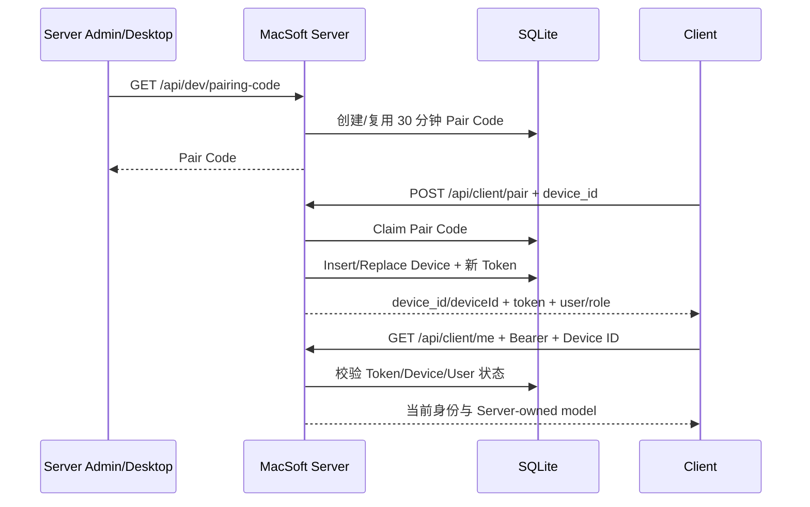
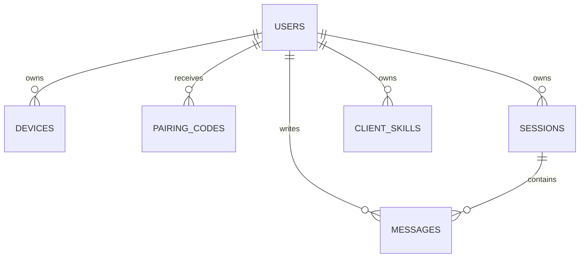
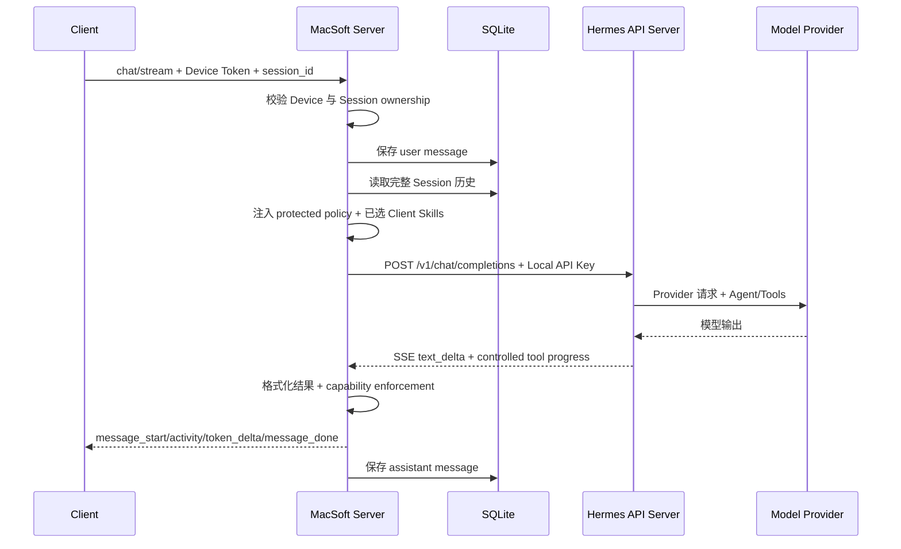
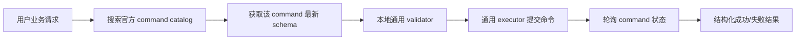
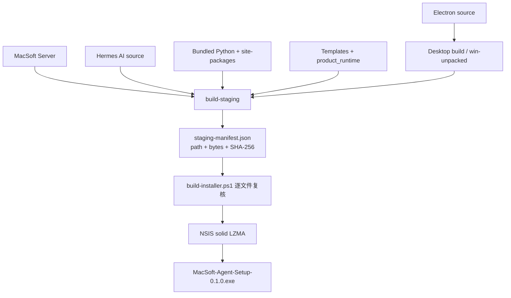
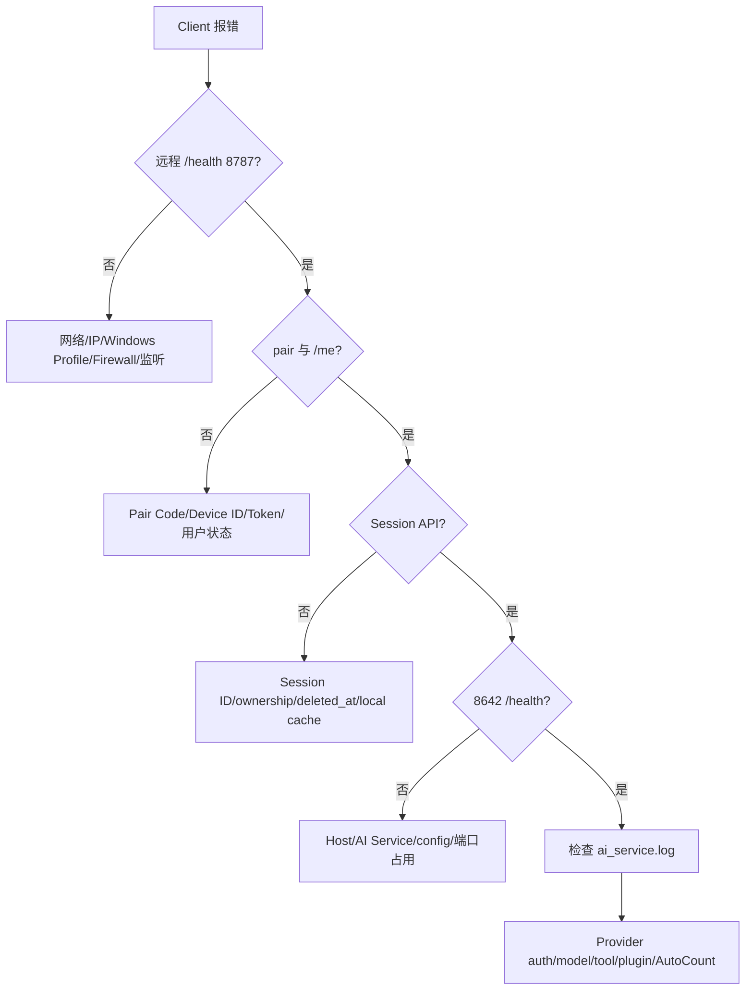

# MacSoft Agent 项目知识地图

> 生成日期：2026-07-16  
> 分析对象：`C:\MacSoft-Agent`  
> 方法：只读源代码、配置、测试、文档、staging manifest 与 release 产物盘点；未运行外部 Client、真实模型或 AutoCount 写入。

---

## 1. 一句话定义这个项目

MacSoft Agent 是一个 Windows 本地部署的多进程 Agent 产品：外部 MacSoft Client 通过局域网 HTTP 连接 MacSoft Server；MacSoft Server 负责设备配对、身份、Session、消息和安全边界，再通过本机内部 API 调用 Hermes AI Runtime；Hermes 负责模型 Provider、Agent 循环、插件和 AutoCount Tool；Windows Host Service 负责初始化、启动、健康检查、日志和进程恢复；最终由 staging manifest + NSIS 打包为单一安装程序。

它不是“一个 Python Server”，而是以下五层组合：

1. **产品化层**：版本、路径、初始化、Host、Windows Service。
2. **业务 API 层**：配对、Device Token、Session、消息、Client Skill、Chat SSE。
3. **AI Runtime 层**：Hermes Gateway、Provider、模型、Agent、Tool/Plugin。
4. **管理 UI 层**：Electron Desktop，负责本机配置和服务控制。
5. **交付层**：Desktop 构建、staging、manifest 审计、NSIS Installer。

---

## 2. 权威来源顺序

项目中同时存在源代码、文档、历史 staging 和多个 release。发生冲突时应按以下顺序判断：

1. **当前源代码和模板**：真实运行逻辑。
2. **当前 `.9` staging manifest**：最终安装载荷的文件与 Hash 合同。
3. **当前最终 Installer 的实际文件 Hash**：发布物事实。
4. **`docs/` 文档**：设计意图和历史验收记录，可能落后于源代码。
5. **`backup/`、`work/`、旧 staging、旧 RC**：仅用于追溯，不是当前权威版本。

当前确认：

| 项目 | 当前值 |
|---|---|
| 产品 | MacSoft Agent |
| 产品版本 | `0.1.0` |
| Build ID | `macsoft-agent-0.1.0-stable.20260714.1` |
| Hermes 基线 | `v2026.7.7.2` / commit `79f127...` |
| 当前 staging | `C:\MacSoft-Agent\staging\MacSoft-Agent-0.1.0-20260714.9` |
| staging 文件数 | 12,643（不含 manifest 自身） |
| staging Payload | 605,417,956 bytes |
| Python | 3.12.10 AMD64 |
| 当前最终 Installer | `C:\MacSoft-Agent\release\MacSoft-Agent-Setup-0.1.0.exe` |
| Installer 大小 | 171,967,983 bytes |
| Installer SHA-256 | `041D0A706A766F9266EA7E385543BC53901417D61D0719DC8F5E8BBF7CD035E5` |

`docs/MACSOFT_PRODUCTION_RUNTIME_FOUNDATION.md` 仍记录 `.5` 和旧文件统计，因此属于历史验收文档，不应覆盖 `.9` manifest 的当前事实。

---

## 3. 系统上下文图



### 最重要的边界

- **只有 8787 面向局域网 Client。**
- 8642、8643、8766 都绑定 `127.0.0.1`，属于本机控制面。
- Client 永远不应直接访问 8642。
- Server 不直接管理 OpenAI OAuth；Hermes Runtime 管理 Provider 凭据。
- Electron Renderer 不直接读取 YAML、Token 或进程表；通过 preload + Electron main 的窄 IPC 访问。

---

## 4. 顶层目录地图

```text
C:\MacSoft-Agent
├─ product.json          产品版本与 Build 元数据，产品级权威
├─ product_runtime/      MacSoft 产品化运行外壳
├─ server/               独立 MacSoft FastAPI Server
├─ hermes/               上游 Hermes 源码 + MacSoft Electron 定制
├─ packaging/            配置模板、受保护资源、NSIS
├─ scripts/              staging、runtime inventory、开发停止脚本
├─ runtime/              开发机 HERMES_HOME；真实凭据/状态，不可发布
├─ runtime.example/      安全示例
├─ docs/                 设计、运维、验收和历史记录
├─ branding/             品牌源资产
├─ staging/              多代安装 Payload
├─ release/              RC 和最终 Installer
├─ backup/               回滚快照
└─ work/                 验收和临时工作目录
```

### 代码所有权

| 区域 | 所有权 | 变化频率 | 核心责任 |
|---|---|---:|---|
| `product_runtime/` | MacSoft | 中 | 初始化、路径、Host、Service、staging |
| `server/macsoft/` | MacSoft | 高 | Client-facing API 和业务安全边界 |
| `packaging/` | MacSoft | 中 | 干净模板、受保护资源、Installer |
| `hermes/` | 上游 Hermes + MacSoft 定制 | 高且复杂 | AI Runtime、Provider、插件、Electron |
| `runtime/` | 单机客户/开发状态 | 运行时变化 | 凭据、配置、插件状态、日志、缓存 |
| `staging/`、`release/` | 构建产物 | 每次发布 | 可安装 Payload 和最终 EXE |

### 源代码治理现状

- `C:\MacSoft-Agent` 当前不是一个 Git 仓库。
- `C:\MacSoft-Agent\hermes` 是嵌套的 Hermes Git checkout。
- 因此 MacSoft 自有的 `server/`、`product_runtime/`、`packaging/` 和根文档没有处在同一个可见的根 Git 历史中。
- 这是可追溯性风险：未来应建立一个 MacSoft 产品根仓库，或明确使用 monorepo/submodule/vendor snapshot 策略。

---

## 5. 技术栈地图

| 层 | 技术 |
|---|---|
| MacSoft Server | Python、FastAPI、Uvicorn、Pydantic、PyYAML |
| 持久化 | SQLite |
| Host | Python、pywin32、psutil、Windows Service、HTTP control |
| AI Runtime | Hermes Agent、Gateway API Server、Provider adapters、Plugin/Skill 系统 |
| Desktop | Electron 40.10.2、React 19、TypeScript 6、Vite 8 |
| Desktop 打包 | electron-builder 26.8.1 |
| 产品安装器 | NSIS，solid LZMA |
| 运行时 | 随产品捆绑的隔离 Python 3.12.10 AMD64 |
| Client Chat Transport | HTTP REST + SSE |

---

## 6. 配置知识地图

### 6.1 `product.json`：产品元数据

位置：`C:\MacSoft-Agent\product.json`

负责：

- 产品版本、channel、build date、build ID。
- Hermes 上游基线版本与 commit。
- 数据 schema 版本、受保护资源版本。
- 将来可选的 HTTPS update manifest；当前为 `null`。

它不保存客户配置和凭据。

### 6.2 `server/macsoft-server.yaml`：Client API Server 配置

模板：`packaging/templates/server/macsoft-server.yaml`  
开发实际文件：`server/macsoft-server.yaml`  
安装实际文件：`C:\ProgramData\MacSoft Agent\server\macsoft-server.yaml`

| 配置块 | 含义 | 当前执行状态 |
|---|---|---|
| `server.host/port` | 对外监听地址与端口 | 实际使用 |
| `database.path` | SQLite 相对路径 | 实际使用 |
| `hermes.api_base_url` | 内部 AI Service 地址 | 实际使用 |
| `hermes.api_key` | Server → AI 内部密钥 | 实际使用 |
| `hermes.request_timeout_seconds` | 内部 AI 请求超时 | 实际使用 |
| `hermes.home` | 运行目录描述 | 当前只写日志，未参与路径解析 |
| `models.default_model/fallback_model` | 逻辑模型字段 | 当前 Server Chat 不使用 |
| `runtime.mode` | minimal/dev 行为开关 | 用于健康信息和 pairing-code 路由可用性 |
| `autocount.enabled/catalog_path` | 早期 Server AutoCount 字段 | `enabled` 只出现在 health；实际 Tool 走 Runtime Plugin |

### 6.3 `runtime/config.yaml`：Hermes AI Runtime 配置

模板：`packaging/templates/runtime/config.yaml`  
开发实际文件：`runtime/config.yaml`  
安装实际文件：`C:\ProgramData\MacSoft Agent\runtime\config.yaml`

负责：

- `model.provider` 与 `model.default`。
- 启用 `api_server`，绑定 `127.0.0.1:8642`。
- 配置内部 API Key。
- 限制 API Server 的 Toolset 为 `macsoft_autocount`。
- 启用 `macsoft-autocount` Plugin。
- 开启 Secret redaction。

当前模板默认 `openai-codex / gpt-5.4`。这只是默认值，不保证每个客户账号有该模型权限；安装后应通过客户 Model Settings 选择账号实际支持的模型。

### 6.4 `SOUL.md`

属于 Hermes Runtime 的身份/行为配置。其变化通常应在新 Session 生效，避免在长对话中改变系统 Prompt 与缓存语义。

### 6.5 AutoCount Plugin 配置

位置：`runtime/plugins/macsoft-autocount/config.json`

主要字段：

- `baseUrl`
- `apiKey`
- `connectorId`
- `companyId`
- request、command、poll timeout

这是敏感配置，不能进入 staging、Git、报告或 Client 响应。

---

## 7. 程序目录与客户数据目录

### 开发模式

| 责任 | 路径 |
|---|---|
| Program root | `C:\MacSoft-Agent` |
| AI Source | `C:\MacSoft-Agent\hermes` |
| Runtime/HERMES_HOME | `C:\MacSoft-Agent\runtime` |
| Server | `C:\MacSoft-Agent\server` |
| Server DB | `C:\MacSoft-Agent\server\data\macsoft-server.db` |

### 安装模式

| 责任 | 路径 |
|---|---|
| 只读程序 | `C:\Program Files\MacSoft Agent` |
| 可写客户数据 | `C:\ProgramData\MacSoft Agent` |
| AI Source | `Program Files\...\ai-service` |
| Python | `Program Files\...\python\python.exe` |
| HERMES_HOME | `ProgramData\...\runtime` |
| Server Config/DB | `ProgramData\...\server` |
| Logs | `ProgramData\...\logs` |
| Host State | `ProgramData\...\config\host` |

设计原则：升级替换 Program Files，正常升级保留 ProgramData。

---

## 8. 首次初始化与升级

入口：`initialize_product_data()`。



初始化遵守两种资源策略：

- **Mutable template，create-once**：客户 YAML、SOUL、AutoCount 配置只在缺失时创建；升级不覆盖客户修改。
- **Protected resource，Hash/version 管理**：MacSoft Plugin 代码可随产品升级；客户修改过的受保护文件不会被静默覆盖，而会保留为冲突。

明确不会从开发机带入：`auth.json`、OAuth 状态、客户 API Key、DB、Session、消息、日志、备份、缓存。

---

## 9. Windows Host 与进程编排

Windows Service：

```text
Service name: MacSoftAgentHost
Display name: MacSoft Agent Host
Account: NT AUTHORITY\LocalService
Startup: Automatic
```

### 启动顺序

```text
config_backend -> ai_service -> server
```

| 服务 | 命令 | 端口 | 健康身份 |
|---|---|---:|---|
| Config Backend | `python -m hermes_cli.main serve` | 8643 | `runtime_mode=config-only` |
| AI Service | `python -m hermes_cli.main gateway run` | 8642 | `status=ok, platform=hermes-agent` |
| MacSoft Server | `python -m macsoft.server` | 8787 | `ok=true, server=MacSoft Server` |

### Host 的可靠性合同

- 60 秒子服务健康超时。
- 检查的不只是端口，还检查健康响应身份。
- 端口被其他进程占用时拒绝启动。
- 正确服务但不是当前 Host 启动的，也拒绝“收养”或终止。
- Windows Job Object/进程树只约束自己创建的子进程。
- 文件锁阻止两个 Host 同时运行。
- 5 分钟内最多自动重启 3 次，之后进入 error。
- 日志 5 MiB，保留 5 个 rotation。
- 日志会遮盖 token/api key/password 和 Program Files/ProgramData 路径。

### Host Control

```text
http://127.0.0.1:8766
```

Token 存在 `config/host/host-control.json`。接口只提供：

- `/v1/status`
- 服务 start/stop/restart
- autostart 设置

它不是 LAN 管理 API；Electron main 读取 Token，Renderer 不接触 Token。

---

## 10. 网络与端口地图

| 端口 | Bind | 访问者 | 是否应暴露 |
|---:|---|---|---|
| 8787 | `0.0.0.0` | 局域网 Client | 是，当前只允许 Domain/Private firewall profile |
| 8642 | `127.0.0.1` | MacSoft Server | 否 |
| 8643 | `127.0.0.1` | Electron 管理配置 | 否 |
| 8766 | `127.0.0.1` | Electron 服务控制 | 否 |
| 5174 | `127.0.0.1` | Vite 开发 Renderer | 仅开发 |

当前 Installer 防火墙规则：

```text
MacSoft Agent Server 8787
TCP 8787
Profiles: Domain, Private
Program: bundled python.exe
```

Windows 将当前 Wi-Fi 分类为 Public 时，规则不匹配；改为 Private 是修改本机对该网络的信任分类，不是修改路由器。

当前 8787 使用 HTTP，因此适合可信 LAN，不适合直接映射到公网。公网方案至少需要 HTTPS reverse proxy/VPN、限流、Pairing 防爆破、Token 生命周期和安全审计。

---

## 11. Client-facing API 地图

统一认证头：

```http
Authorization: Bearer <device_token>
X-Device-Id: <device_id>
```

| 方法与路径 | 认证 | 责任 |
|---|---|---|
| `GET /health` | 无 | Server 存活和版本 |
| `GET /api/dev/pairing-code` | 无；仅 minimal/dev | 获取或创建默认管理员 Pair Code |
| `POST /api/client/pair` | Pair Code | 建立/替换 Device，返回 Device Token |
| `GET /api/client/me` | Device | 返回用户、角色、Server-owned 模型合同 |
| `GET /api/sessions` | Device | 列出当前用户未删除 Session |
| `POST /api/sessions` | Device | 创建 Session |
| `GET /api/sessions/{id}/messages` | Device + ownership | 获取消息 |
| `DELETE /api/sessions/{id}` | Device + ownership | 幂等 soft delete |
| `POST /api/chat/stream` | Device + Session ownership | 单一 Chat/SSE 路径 |
| `/api/client/skills...` | Device | Client Skill 验证与 CRUD |

### 需要特别注意

- `/api/dev/pairing-code` 在当前 `minimal` 运行模式无认证、可从 LAN 访问。这削弱了 Pair Code 作为秘密的意义，是正式产品化前的重要安全治理点。
- CORS 当前为 `allow_origins=["*"]`，虽然不允许 browser credentials，但仍属于宽松策略。

---

## 12. 配对与设备身份流程



当前合同：

- Pair Code：6 位数字，默认 30 分钟，一次性。
- Device Token：`token_urlsafe(48)`。
- 相同 `device_id` 再配对会生成新 Token，并覆盖旧 Device 记录。
- Token 与 Device ID、Device 状态、revoked_at、User 状态联合验证。
- Pair 成功返回 snake_case + camelCase 兼容字段。
- Token 当前明文存储于 SQLite，没有独立过期时间、轮换 API 或公开 revoke API。

---

## 13. Session 与消息模型

### SQLite 表



| 表 | 核心责任 |
|---|---|
| `users` | 用户显示名、角色、状态 |
| `devices` | Device ID、Token、Client 版本、配对状态 |
| `pairing_codes` | 一次性 Pair Code 和到期/领取状态 |
| `sessions` | 会话元数据、状态、soft-delete 时间 |
| `messages` | user/assistant 内容和模型标记 |
| `client_skills` | 用户拥有的请求级偏好文档 |

### Session 删除

- `DELETE` 只设置 `deleted_at`，不删除物理行。
- 重复删除同一 owned Session 返回成功但 `deleted=false`。
- 正常 list/history/chat/message append 都排除已删除 Session。
- 当前没有管理员 restore、retention 或物理 purge 策略。
- Session DB 与 Hermes Provider `auth.json` 是不同存储；删除 Session 按代码不会删除 OpenAI 凭据。

---

## 14. Chat 与 SSE 主链

`POST /api/chat/stream` 是唯一 Client Chat 路径。



### Client 与 Server 的模型所有权

- Client 可发送 `preferred_model_id`，但 Server 明确忽略。
- `/api/client/me` 只返回逻辑模型 `server-hermes-current`。
- 真实 Provider/Model 由 `runtime/config.yaml` 和 Hermes 当前配置决定。

### Activity v1

Client 通过：

```http
X-MacSoft-Client-Capabilities: activity-v1
```

启用附加 `event: activity`。Activity 是临时展示，不写入 messages 表；只映射受控 Tool 名称和 `running/completed` 状态，不返回 Tool 参数、结果、Prompt 或内部推理。

### 当前“流式”的真实语义

- Server 会流式读取内部 Hermes SSE，并可逐步发送 Activity。
- 但文本会先累计到完整 `assistant_text`，再通过一个 `token_delta` 事件一次性发给 Client。
- 因此当前并不是逐 Token 向外部 Client 显示文字；只有活动状态是增量的。

### 错误兼容差异

- 旧 Client（无 `activity-v1`）：AI Service 在外部 SSE 开始前失败时，Server 返回 HTTP 502。
- Activity v1 Client：外层 SSE 已建立，AI 错误被转换为经过清洗的 assistant Markdown，保存到 DB，并通过 `message_done.ok=false` 结束。

---

## 15. Server 安全与结果控制

Server 在每次 Chat 前插入受保护 System Instruction：

- Client Skill 不能覆盖系统安全、Tool 权限、认证和 schema 验证。
- AutoCount 只能使用批准的 AutoCount Tools。
- 当前天气、新闻、市场、汇率、交通、体育等实时信息，没有经过同一次 Agent run 的已批准 Tool 成功结果时不能宣称已验证。
- 不暴露系统 Prompt、私有推理、Token、Tool 原始参数、Stack trace 和本地路径。

最终响应还经过 defense-in-depth：

- 对实时信息请求再次分类。
- 当前所有 live-data capability 的批准 Tool 集合为空，因此会替换成限制说明。
- JSON-ish AutoCount 结果可转成可读 Markdown；普通 Markdown 保持不变。
- 敏感字段会从业务表格/摘要中移除。

---

## 16. Client Skill 边界

Client Skill 是用户拥有的“请求级偏好文本”，不是可执行 Plugin。

限制包括：

- slug/name/description/content 长度限制。
- UTF-8 内容最多 65,536 bytes。
- 一次请求最多选择 5 个。
- 拒绝脚本代码块、shebang、PowerShell/cmd、路径穿越、Secret、Bearer Token。
- 拒绝覆盖 System Prompt、SOUL、Tool 权限、认证和 schema 验证的内容。
- 只加载当前 authenticated owner 且 enabled 的 Skill。
- 作为 JSON-encoded untrusted text 放入 System Instruction。

---

## 17. Hermes AI Runtime 地图

Hermes 是大型上游系统，MacSoft 并未重写其 Agent Core。MacSoft 使用的关键窄腰是：

```text
hermes_cli.main gateway run
  -> gateway/platforms/api_server.py
  -> POST /v1/chat/completions
  -> Provider/Agent loop
  -> Plugin/Toolset
```

### HERMES_HOME

Host 明确设置：

```text
HERMES_HOME=C:\ProgramData\MacSoft Agent\runtime
```

这里保存：

- `config.yaml`
- `auth.json` / OAuth Provider 状态
- `SOUL.md`
- Plugin、Skill、Memory、Session、缓存和日志

安装包不会带开发者 `auth.json`。每台 Server 机器必须自行登录 Provider。

### Tool 面控制

当前 Runtime 配置：

```yaml
platform_toolsets:
  api_server:
    - macsoft_autocount
```

目标是让 Client-facing API Server 只看到 MacSoft AutoCount 的五个 Tools，而不是 Hermes 全套 terminal、browser、file write、delegation、automation 等能力。

---

## 18. AutoCount Plugin 地图

Plugin 提供五个通用 Tool：

1. `autocount_get_connector_status`
2. `autocount_search_commands`
3. `autocount_get_command_schema`
4. `autocount_validate_command`
5. `autocount_execute_command`

设计不是“每个业务动作写一个 Python 文件”，而是动态 Schema 驱动：



主要不变量：

- 不猜 command type。
- 每次执行前读取官方 schema。
- 先 validate，失败不得提交。
- 不通过 Terminal、生成 Python、浏览器点击或 SQL 操作 AutoCount。
- 不额外建立 MacSoft 命令白名单；是否允许由官方 API Key、Connector 权限、Cloud 和 Local Connector 控制。
- Tool transport 完成不等于业务成功，必须看最终业务状态。

---

## 19. Electron Desktop 地图

安装包中的 Desktop 主要是本机管理员控制台，不是外部 MacSoft Client。

```text
React Renderer
  -> preload bridge
  -> Electron main IPC
  -> Host Control / Config Backend / 文件配置服务
```

### MacSoft 专用模块

| 文件 | 责任 |
|---|---|
| `electron/macsoft-product.ts` | Development/Packaged 路径合同 |
| `electron/macsoft-host-client.ts` | 8766 Host 控制客户端 |
| `electron/server-autocount-config.ts` | Server/Runtime/AutoCount 配置读取、验证、备份、原子写入 |
| `electron/macsoft-product-initializer.ts` | Packaged 首次数据初始化 |
| `electron/macsoft-update-policy.ts` | Installer-managed update 策略 |
| `src/app/settings/server-autocount-settings.tsx` | Server、网络、AI、AutoCount 管理页 |
| `src/app/settings/macsoft-model-settings.tsx` | 客户 Runtime Provider/Model 页面 |

### Packaged customer mode

`app.isPackaged` 会让 Renderer 进入 `macSoftCustomerRuntime`：

- 隐藏 Hermes onboarding/bootstrap/update/gateway failure UI。
- 首次运行导向 Server & AutoCount Settings。
- Model Settings 走窄 IPC，仅修改 `model.provider` 和 `model.default`。
- Desktop 关闭不会停止 Windows 后台服务。
- Update 状态为 `installer-managed`；当前没有在线增量更新。

虽然打包代码仍包含大量继承的 Hermes Desktop 功能和翻译字符串，但产品模式通过 gating 隐藏部分旧 Surface。这是维护风险：每次上游合并都应验证客户模式没有重新暴露不需要的 Hermes UI。

---

## 20. 构建与发布链



### Desktop 阶段

`apps/desktop/package.json` 定义：

- TypeScript + Vite + Electron main bundle。
- native dependencies staging。
- `asar`，并 unpack native `.node`/prebuilds/dist。
- electron-builder 可输出 win-unpacked、NSIS、MSI。

产品总安装包并不直接使用 Electron 自己的 NSIS 作为最终 Server Installer；它先取 `win-unpacked` 放入总 staging。

### Staging 阶段

入口：`scripts/build-staging.ps1` → `macsoft_runtime.staging`。

输出布局：

```text
product.json
desktop/
macsoft_runtime/
ai-service/
server/
python/
templates/
staging-manifest.json
```

审计会拒绝：

- `.git`
- `auth.json`
- 数据库、state DB、client_skills 状态
- `.env`、日志、备份、pyc
- editable Python metadata、egg-link、开发绝对路径

`build-staging` 要求目标目录为空。正式发布应从新的空 staging 生成；若对 `.9` 做受控同步，必须重新生成完整 manifest 并再次审计。

### Installer 阶段

`packaging/build-installer.ps1` 在调用 NSIS 前验证：

- manifest 中没有缺失文件。
- staging 没有额外文件。
- 每个文件 bytes 一致。
- 每个文件 SHA-256 一致。

NSIS 安装动作：

- 管理员权限、安装到 64-bit Program Files。
- 初始化 ProgramData。
- 注册 LocalService Windows Service。
- 配置 Service recovery。
- 创建 Domain/Private 8787 firewall rule。
- 启动 Host。
- 150 秒内验证 8642、8787、8766。
- 创建快捷方式、卸载项和失败回滚。

卸载会移除 Service、firewall、快捷方式和 Program Files，但不会删除 ProgramData 客户数据。

### 当前发布风险

- 当前 custom NSIS 没有看到明确的代码签名步骤；若没有外部签名流程，Windows 可能显示未知发布者。
- 安装 Section 没有显式“升级前停止旧 Host，再替换文件”的升级分支；覆盖安装需要单独验收。
- `makensis.exe` 默认从 electron-builder 本机 cache 查找，构建机可复现性依赖该 cache。
- 多个旧 staging/RC 与最终产物并存，发布时必须以明确路径和 SHA-256 交付。

---

## 21. 开发运行与安装运行的区别

### 开发/恢复模式

```text
start-hermes-gateway.bat
  -> HERMES_HOME=C:\MacSoft-Agent\runtime
  -> 8642

start-macsoft-server.bat
  -> server/.venv
  -> 8787

start-hermes-desktop.bat
  -> Vite 5174 + Electron dev
```

`start-all.bat` 按 8642 → 8787 → Desktop 顺序启动。

这个流程不会完整模拟安装版 Windows Service 和 Config Backend；它是开发/恢复工具。

### 安装模式

```text
Windows SCM
  -> MacSoftAgentHost
  -> Config Backend + AI Service + Server
  -> Electron 只作为管理 UI
```

不要用开发 BAT 作为客户启动方案。

---

## 22. 测试与验证地图

当前静态盘点：

| 测试区 | 文件数 | 测试数 | 主要覆盖 |
|---|---:|---:|---|
| `server/tests` | 6 | 49 | Activity/SSE、AutoCount validator、capability、Client Skill、路径、Session delete |
| `product_runtime/tests` | 4 | 19 | 初始化、路径、Host、安全停止、control、staging |
| MacSoft Electron focused tests | 6 | 36 | customer runtime、Host、产品路径、初始化、更新、配置 |
| MacSoft Renderer focused tests | 3 | 12 | 客户导航、Model Settings、Server Settings |

本次知识地图没有执行测试；以上是当前源代码静态计数。

### 推荐验证金字塔

1. **静态合同**：配置解析、manifest、路径、Secret audit。
2. **单元/集成**：临时 HERMES_HOME、临时 DB、mock Provider/Cloud。
3. **staging smoke**：只使用 bundled Python，不依赖系统 Node/Python/Git。
4. **Installer clean-machine**：安装、Service、firewall、health、卸载、数据保留。
5. **真实 Client acceptance**：health、pair、me、Session、SSE、删除。
6. **Provider acceptance**：客户账号认证与支持模型。
7. **AutoCount acceptance**：先只读，再经过授权的写入业务场景。

---

## 23. 日志与故障定位地图

安装版日志：

```text
C:\ProgramData\MacSoft Agent\logs\host.log
C:\ProgramData\MacSoft Agent\logs\config_backend.log
C:\ProgramData\MacSoft Agent\logs\ai_service.log
C:\ProgramData\MacSoft Agent\logs\server.log
```

### 分层诊断顺序



### 常见症状映射

| 症状 | 最可能层 |
|---|---|
| `failed to fetch` 且远程 health 失败 | 网络/firewall/Profile |
| health 成功、pair 失败 | Pair Code/Client payload |
| `/me` 401 | Device Token 或 Device ID |
| chat 404 | Session 不存在、属于别人或已删除 |
| chat 200 但 `message_done.ok=false` | SSE 内部 AI/Provider 失败 |
| `No Codex credentials stored` | 该 Server 的 HERMES_HOME 未认证 |
| 模型 `not supported` | Runtime 默认模型超出该账号 entitlement |
| `plugins.web` import warning | 可选 Web Plugin 打包缺失；与 Codex auth 可分别判断 |

---

## 24. 当前安全模型

### 已有防线

- 8642/8643/8766 loopback-only。
- Server → AI 使用随机本机 API Key。
- Device Token + Device ID 联合认证。
- Pair Code 一次性、30 分钟到期。
- Session owner isolation。
- Client Skill owner isolation 和严格文本验证。
- Client-facing Toolset 限制为 AutoCount。
- Protected capability policy + final-response enforcement。
- 日志和错误脱敏。
- Host 进程所有权和端口占用保护。
- staging Secret/路径/状态审计与 manifest Hash。
- Windows firewall 默认只开放 Domain/Private。

### 需要治理的风险

| 优先级 | 风险 | 影响 |
|---|---|---|
| 高 | 8787 是 HTTP，无 TLS | 不适合公网；LAN 中 Token/消息不加密 |
| 高 | `/api/dev/pairing-code` 在 minimal 无认证 | 同 LAN 访问者可获取 Pair Code |
| 高 | Pair/chat 无明确速率限制 | Pair Code 爆破、资源/模型成本滥用 |
| 中高 | Device Token 明文入 SQLite，无到期/公开 revoke API | DB 泄露和长期 Token 生命周期风险 |
| 中高 | CORS `*` | Browser-origin 边界过宽 |
| 中 | ProgramData ACL 给 Builtin Users Modify | 多用户 Windows 上本地用户可修改产品运行状态 |
| 中 | 单一默认 Admin，无正式用户管理 | 多用户/企业角色模型不完整 |
| 中 | 默认 `gpt-5.4` 不保证客户权限 | 新安装可健康但 Chat 失败 |
| 中 | 未观察到 Installer signing step | SmartScreen/供应链可信度问题 |
| 中 | 覆盖升级流程未显式停止旧 Host | 文件锁、Service 重注册和部分升级风险 |
| 中 | 无 Session retention/purge/restore 策略 | 数据治理不完整 |
| 低中 | 客户模式仍打包大量继承 Hermes UI | 上游更新可能重新暴露不需要 Surface |

---

## 25. 已实现、占位与遗留代码

### 已完整接入主链

- Host/Windows Service。
- Program Files/ProgramData 路径分离。
- 初始化、Local API Key、protected resources。
- Pair/Device auth。
- Session/message/soft delete。
- 单一 Chat/SSE 路径。
- Activity v1。
- Client Skill CRUD/请求级注入。
- AI Service bridge。
- AutoCount 通用 Tool Plugin。
- Desktop 本机设置与服务控制。
- staging manifest + NSIS。

### 当前占位或接受但未使用

- `server.yaml models.default_model/fallback_model`：解析但 Chat 不使用。
- `server.yaml hermes.home`：当前只打印日志。
- `autocount.catalog_path`：当前 Server 主链不使用。
- Chat `preferred_model_id`：接受但明确忽略。
- Chat `uploaded_file_ids`：接受但未使用。
- Chat `client_info`：接受但未使用。
- `sessions.hermes_stored_session_id`：持久化字段存在，但当前不绑定 Hermes Session。
- `/api/client/me allowed_skills`：固定空数组，与 Client Skill API 尚未统一成一个发现合同。

### 遗留/可清理候选

- `server/macsoft/chat/chat_service.py` 中 mock reply 没有被当前 Server 引用。
- `server/autocount-api-result.txt`、`macsoft-hermes-bridge-input.txt` 是开发证据，不应视为产品源码。
- 多个旧 `staging/.1-.8`、RC1/RC2、work/backup 需要明确保留策略。
- 文档中的旧 staging/Hash/进程数量需要刷新。

---

## 26. 变更影响矩阵

| 想改什么 | 首先查看 | 还必须验证 |
|---|---|---|
| Server 端口/监听 | server template、Host spec、NSIS firewall、Desktop settings | health、远程 LAN、安装器 |
| AI 端口 | runtime template、server template、Host、Desktop config | 8642 health、Server bridge |
| Pair 响应 | `routes_client.py`、devices/pairing、Client contract test | snake/camel 兼容、存储关系 |
| Session | routes/session_store/message_store/db | migration、owner isolation、soft delete |
| Chat/SSE | `routes_chat.py`、`hermes_client.py`、activity/result formatter | old Client、activity-v1、错误持久化 |
| Provider/Model | runtime template、Hermes auth/model、Desktop model settings | 客户 entitlement、重启、新 Session |
| AutoCount Tool | protected plugin、schema、validator、Toolset config | Secret redaction、只读/写入授权 |
| Desktop 管理 UI | Renderer + preload + main IPC + config service | customer mode、Renderer 无 Secret |
| Host/Service | product_runtime host/control/service | ownership、health、restart、uninstall |
| Installer | staging、manifest、NSIS、health script | clean install、upgrade、uninstall、Hash |
| 上游 Hermes 合并 | `hermes/AGENTS.md`、MacSoft 定制文件、runtime pin | customer gating、Toolset、Prompt cache |

---

## 27. 从零复现同类框架的顺序

1. **定义产品元数据**：产品名、版本、Build ID、数据 schema、上游 pin。
2. **分开程序与数据**：Program Files 只放代码；ProgramData 放配置、DB、凭据和日志。
3. **定义两个配置合同**：外部 Server YAML 与内部 AI Runtime YAML。
4. **实现幂等初始化**：create-once customer config + versioned protected resources + generated local secret。
5. **建立 AI 内部接口**：loopback-only、内部 key、标准 Chat API。
6. **建立 Client API**：health → pair → device auth → Session → Chat SSE。
7. **建立数据模型**：用户、设备、Pair Code、Session、消息和扩展状态。
8. **建立安全优先级**：Server protected policy > Public/Client Skill > user message。
9. **建立 Host supervisor**：顺序启动、身份健康检查、进程所有权、日志和重启上限。
10. **建立管理 UI 的窄 IPC**：Renderer 不直接读 Secret/文件/进程。
11. **建立扩展机制**：用 Plugin + Schema 驱动 Tool，避免业务命令硬编码进 Agent Core。
12. **建立 staging allowlist/audit**：不从工作目录直接压缩发布。
13. **建立 manifest**：每个文件 path、bytes、SHA-256。
14. **Installer 先验证 manifest 再打包**。
15. **按层验收**：静态 → 单元 → staging → Installer → Client → Provider → 业务系统。

可以抽象为：

```text
Product Metadata
  -> Initialization Contract
  -> Process Supervisor
  -> External API Boundary
  -> Internal AI Boundary
  -> Plugin/Business Boundary
  -> Durable Data Boundary
  -> Desktop Admin Boundary
  -> Reproducible Packaging Boundary
```

---

## 28. 核心文件索引

### 产品化与 Host

- `product.json`
- `product_runtime/macsoft_runtime/paths.py`
- `product_runtime/macsoft_runtime/initializer.py`
- `product_runtime/macsoft_runtime/host.py`
- `product_runtime/macsoft_runtime/control.py`
- `product_runtime/macsoft_runtime/service.py`
- `product_runtime/macsoft_runtime/staging.py`

### Server

- `server/macsoft/server.py`
- `server/macsoft/config.py`
- `server/macsoft/db.py`
- `server/macsoft/gateway/routes_client.py`
- `server/macsoft/gateway/routes_sessions.py`
- `server/macsoft/gateway/routes_chat.py`
- `server/macsoft/gateway/routes_skills.py`
- `server/macsoft/chat/hermes_client.py`
- `server/macsoft/chat/activity.py`
- `server/macsoft/chat/capability_policy.py`
- `server/macsoft/chat/result_formatter.py`

### AutoCount

- `packaging/templates/protected/runtime/plugins/macsoft-autocount/plugin.yaml`
- `.../__init__.py`
- `.../schemas.py`
- `.../validator.py`
- `.../tools.py`
- `.../skills/autocount-operations/SKILL.md`

### Desktop

- `hermes/apps/desktop/package.json`
- `hermes/apps/desktop/electron/macsoft-product.ts`
- `hermes/apps/desktop/electron/macsoft-host-client.ts`
- `hermes/apps/desktop/electron/server-autocount-config.ts`
- `hermes/apps/desktop/electron/main.ts`
- `hermes/apps/desktop/electron/preload.ts`
- `hermes/apps/desktop/src/app/settings/server-autocount-settings.tsx`
- `hermes/apps/desktop/src/app/settings/macsoft-model-settings.tsx`

### 发布

- `scripts/build-staging.ps1`
- `packaging/build-installer.ps1`
- `packaging/installer/MacSoft-Agent.nsi`
- `packaging/installer/verify-health.ps1`
- `staging/MacSoft-Agent-0.1.0-20260714.9/staging-manifest.json`

---

## 29. 最终心智模型

如果要向另一个工程师解释整个系统，只需要说清这段话：

> Installer 把不可变程序安装到 Program Files，并在 ProgramData 初始化客户配置、SQLite、Runtime 和本机密钥。Windows 的 MacSoftAgentHost 按顺序启动本机 Config Backend、Hermes AI Service 和面向 LAN 的 MacSoft Server。外部 Client 只连接 8787，先用一次性 Pair Code 换取 Device Token，再以设备身份创建 Session 和发送 Chat。MacSoft Server 保存业务会话、注入安全规则并通过本机密钥调用 8642；Hermes 根据 HERMES_HOME 中的 Provider、模型和 Plugin 配置执行 Agent/AutoCount Tool；Server 将受控 Activity 和最终文本通过 SSE 返回并保存消息。Electron Desktop 只通过窄 IPC 管理本机配置与 Host，不成为第二条 Chat 执行路径。发布时所有文件先进入经过 Secret/路径审计的 staging，写入逐文件 SHA-256 manifest，再由 NSIS 生成最终 Installer。

